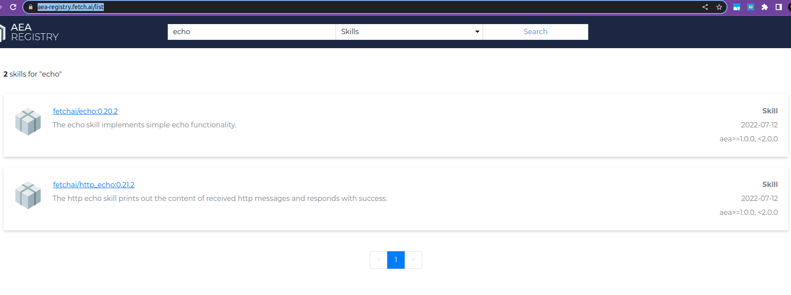

# AEA Quickstart

https://open-aea.docs.autonolas.tech/quickstart/

Terminal 1:
```sh
pipenv --python 3.10
pipenv shell
pip install 'open-aea[all]'
pip install 'open-aea-ledger-ethereum'
pip install 'open-aea-cli-ipfs'

aea init --remote  

aea fetch open_aea/my_first_aea:0.1.0:bafybeibnjfr3sdg57ggyxbcfkh42yqkj6a3gftp55l26aaw2z2jvvc3tny --remote
cd my_first_aea

aea install
aea generate-key ethereum
aea add-key ethereum

aea run
```

Note: The same steps can be performed programmatically via https://open-aea.docs.autonolas.tech/build-aea-programmatically/

Terminal 2:

```sh
cd my_first_aea
echo 'my_first_aea,sender_aea,fetchai/default:1.0.0,\x12\x10\x08\x01\x12\x011*\t*\x07\n\x05hello,' >> input_file
```

## AEA Registry

https://aea-registry.fetch.ai/list



## Core Components of an AEA

https://open-aea.docs.autonolas.tech/core-components-1/

## Real world deployments

### El Collectooorr 

- [Introduction Presentation video](https://www.youtube.com/watch?v=TFEmhM0XSQQ)
- [code - GH](https://github.com/valory-xyz/ethlisbon)
- 